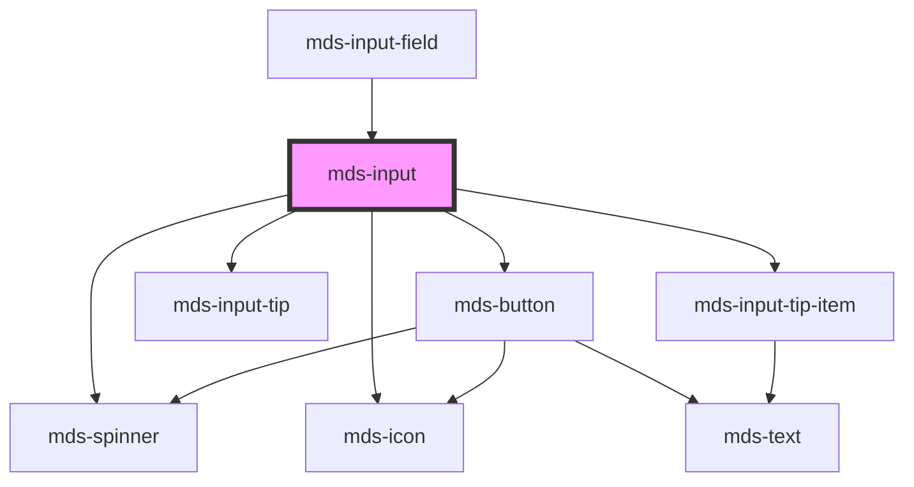

# mds-input

## Form interaction

This component is `scoped` and not `shadowed`, so the inner `input` element interacts natively with `form` element.

This is a web-component from Maggioli Design System [Magma](https://magma.maggiolicloud.it), built with StencilJS, TypeScript, Storybook. It's based on the web-component standard and it's designed to be agnostic from the JavaScript framework you are using.

<!-- Auto Generated Below -->

## Properties

| Property               | Attribute                | Description                                                                                                     | Type                                                                                                                       | Default      |
| ---------------------- | ------------------------ | --------------------------------------------------------------------------------------------------------------- | -------------------------------------------------------------------------------------------------------------------------- | ------------ |
| `autocomplete`         | `autocomplete`           | Specifies whether the element should have autocomplete enabled                                                  | `AutocompleteType \| undefined`                                                                                            | `'off'`      |
| `autofocus`            | `autofocus`              | Specifies that the element should automatically get focus when the page loads                                   | `boolean`                                                                                                                  | `false`      |
| `await`                | `await`                  | Specifies if the spinner icon is shown, replacing the icon if present                                           | `boolean`                                                                                                                  | `false`      |
| `controlDecreaseLabel` | `control-decrease-label` | Specifies the label for control button decrease for component when type is number                               | `string \| undefined`                                                                                                      | `'Riduci'`   |
| `controlIncreaseLabel` | `control-increase-label` | Specifies the label for control button increase for component when type is number                               | `string \| undefined`                                                                                                      | `'Aumenta'`  |
| `controlsIcon`         | `controls-icon`          | Specifies the icon type of the counter button when the input type is set to `number`                            | `"arithmetic" \| "arrow" \| undefined`                                                                                     | `'arrow'`    |
| `controlsLayout`       | `controls-layout`        | Specifies the layout of the counter button when the input type is set to `number`                               | `"horizontal" \| "vertical" \| undefined`                                                                                  | `'vertical'` |
| `datalist`             | --                       | A list of search terms to be searched from the input field, it should be used with type="search" input.         | `string[] \| undefined`                                                                                                    | `undefined`  |
| `disabled`             | `disabled`               | If true, the element is displayed as disabled                                                                   | `boolean \| undefined`                                                                                                     | `false`      |
| `icon`                 | `icon`                   | An icon displayed at the right of the input                                                                     | `string \| undefined`                                                                                                      | `undefined`  |
| `max`                  | `max`                    | Specifies the maximum value use it with input type="number" or type="date" Example: max="180", max="2046-12-04" | `string \| undefined`                                                                                                      | `undefined`  |
| `maxlength`            | `maxlength`              | Specifies the maximum number of characters allowed in an element use it with input type="number"                | `number \| undefined`                                                                                                      | `undefined`  |
| `min`                  | `min`                    | Specifies the minimum value use it with input type="number" or type="date" Example: min="-3", min="1988-04-15"  | `number \| string \| undefined`                                                                                            | `undefined`  |
| `minlength`            | `minlength`              | Specifies the minimum number of characters allowed in an element use it with input type="number"                | `number \| undefined`                                                                                                      | `undefined`  |
| `name`                 | `name`                   | Is needed to reference the form data after the form is submitted                                                | `string \| undefined`                                                                                                      | `undefined`  |
| `pattern`              | `pattern`                | Specifies a regular expression that element\'s value is checked against                                         | `string \| undefined`                                                                                                      | `undefined`  |
| `placeholder`          | `placeholder`            | Specifies a short hint that describes the expected value of the element                                         | `string`                                                                                                                   | `''`         |
| `readonly`             | `readonly`               | Specifies that the element is read-only                                                                         | `boolean \| undefined`                                                                                                     | `false`      |
| `required`             | `required`               | Specifies that the element must be filled out before submitting the form                                        | `boolean \| undefined`                                                                                                     | `false`      |
| `step`                 | `step`                   | Specifies the interval between legal numbers in an input field                                                  | `string \| undefined`                                                                                                      | `undefined`  |
| `tip`                  | `tip`                    | Sets the word(s) of the tip of the input field                                                                  | `string \| undefined`                                                                                                      | `undefined`  |
| `type`                 | `type`                   | Specifies the type of input element                                                                             | `"date" \| "email" \| "number" \| "password" \| "search" \| "tel" \| "text" \| "textarea" \| "time" \| "url" \| undefined` | `'text'`     |
| `typography`           | `typography`             | Specifies the typography of input element                                                                       | `"detail" \| "snippet"`                                                                                                    | `'detail'`   |
| `value`                | `value`                  | Specifies the value of the input element                                                                        | `string \| undefined`                                                                                                      | `''`         |
| `variant`              | `variant`                | Sets the variant of the input field                                                                             | `"error" \| "info" \| "success" \| "warning" \| undefined`                                                                 | `undefined`  |

## Events

| Event             | Description                                                                       | Type                               |
| ----------------- | --------------------------------------------------------------------------------- | ---------------------------------- |
| `mdsInputBlur`    | Emits a void event when input element is blurred                                  | `CustomEvent<void>`                |
| `mdsInputChange`  | Emits an InputChangeEventDetail when the value of the input element changes       | `CustomEvent<MdsInputEventDetail>` |
| `mdsInputFocus`   | Emits a void event when input element is focused                                  | `CustomEvent<void>`                |
| `mdsInputKeydown` | Emits a KeyboardEvent when a keyboard key is pressed on the focused input element | `CustomEvent<KeyboardEvent>`       |

## Methods

### `getInputElement() => Promise<HTMLInputElement | HTMLTextAreaElement>`

Returns the native `<input>` element used under the hood.

#### Returns

Type: `Promise<HTMLTextAreaElement | HTMLInputElement>`

### `setFocus() => Promise<void>`

Sets focus on the specified `my-input`.
Use this method instead
of the global `input.focus()`.

#### Returns

Type: `Promise<void>`

### `updateLang() => Promise<void>`

#### Returns

Type: `Promise<void>`

## Shadow Parts

| Part                        | Description |
| --------------------------- | ----------- |
| `"counter-button-decrease"` |             |
| `"counter-button-increase"` |             |
| `"field"`                   |             |
| `"password-toggle-button"`  |             |

## CSS Custom Properties

| Name                                | Description                                                                                                               |
| ----------------------------------- | ------------------------------------------------------------------------------------------------------------------------- |
| `--mds-input-background`            | Sets the background-color of the component                                                                                |
| `--mds-input-icon-color`            | Sets the icon color of the component                                                                                      |
| `--mds-input-ring`                  | Sets the box-shadow of the component's input                                                                              |
| `--mds-input-shadow`                | Sets the box-shadow of the component's input                                                                              |
| `--mds-input-textarea-field-sizing` | Sets the height of the textarea automatically, this is an EXPERIMENTAL css property, so it couldn't work in every browser |
| `--mds-input-textarea-max-height`   | Sets the `max-height` of the component when attribute `type` is set to `textarea`                                         |
| `--mds-input-textarea-min-height`   | Sets the `min-height` of the component when attribute `type` is set to `textarea`                                         |
| `--mds-input-tip-background`        | Sets the background color of the tip message at the bottom right of the component                                         |
| `--mds-input-variant-color`         | Sets the variant colors of the component                                                                                  |

## Dependencies

### Used by

 - [mds-input-field](../mds-input-field)

### Depends on

- [mds-button](../mds-button)
- [mds-input-tip](../mds-input-tip)
- [mds-input-tip-item](../mds-input-tip-item)
- [mds-icon](../mds-icon)
- [mds-spinner](../mds-spinner)

### Graph

----------------------------------------------

Built with love @ [Gruppo Maggioli](https://www.maggioli.com) from [R&D Department](https://www.maggioli.com/it-it/chi-siamo/ricerca-sviluppo)
